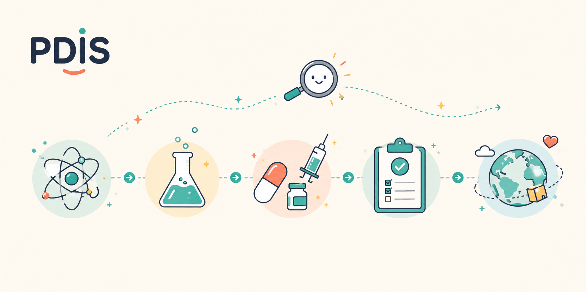

# PDIS — Product Development Intelligence Suite

<p align="center">
  
  
  
  
</p>
<p align="center">
  
  
  
  
</p>

PDIS helps teams write and pressure-test product-development documents — Target Product Profiles (TPPs) and Integrated Product Development Plans (IPDPs). You upload a document and it comes back three ways: parsed into citable blocks, graded against a rubric, or tested against real-world evidence from the web. A chat assistant ("Ask") answers questions about any result.

## Architecture

```
web/ (Next.js)  →  api/ (FastAPI)  →  services/  →  shared/
```

Imports go one direction only: web → api → services → shared, never the reverse. Services reach each other only through their `__init__.py` public contract — not into another service's `stages/` or `models.py`.

`shared/` holds the cross-cutting pieces: the OpenAI client and two controlled vocabularies (`indications.yaml`, `attributes.yaml`).

## Services

| Folder | UI | What it does | Depends on |
|---|---|---|---|
| `chunker` | Chunker | Parse `.docx`/`.pdf` into ordered, citable `ContentBlock`s; optionally label sections and describe embedded figures. | — |
| `reviewer` | Reviewer | Grade a document against its rubric on completeness, adherence, and rigor, then check consistency across sections. | chunker |
| `searcher` | Searcher | Turn a query into source-attributed `Finding`s across three backends: web search, PubMed, and ClinicalTrials.gov. | openai_client, NCBI |
| `scout` | Scout | Test a document's targets against live evidence — drift, evidence weight, conformity, and precedent. Targets come from a fixed attribute list (TPP) or are extracted from the document (IPDP). | chunker, searcher |
| `assistant` | Ask | Read-only chat grounded in a Scout or Reviewer result; navigates the result and can open the sources it already cites. | openai_client |

Each service has its own README with its file map and public contract.

## The four inputs

Document tools take four fields, chosen once in the sidebar:

| Field | What it's for |
|---|---|
| `org` | who published the source (e.g. `bmgf`) |
| `source_type` | document type: `itpp` (intervention TPP), `ctpp` (candidate TPP), or `ipdp` (integrated product development plan) |
| `intervention_class` | `vaccine`, `drug`, `diagnostic`, `device` |
| `indication` | disease, e.g. `malaria`, `hiv`, `tb` |

The first three select configs; all four are stamped on every output, and `indication` also scopes Scout's search. You only need them to *run* — the page loads without them, so you can import a saved result anytime. Searcher is query-only and ignores these.

## Configs and vocabularies

Domain content lives in YAML, maintained by hand:

| Surface | Path | Role |
|---|---|---|
| chunker config | `services/chunker/configs/{org}_{source_type}_{intervention}.yaml` | section taxonomy + optional `image_lens` |
| reviewer config | `services/reviewer/configs/…` | grading rubric + stage bar (`grading_guidance`) |
| scout config | `services/scout/configs/…` | query tuning (languages, priority sources, per-track budgets) + `unit_provider` |
| indications | `shared/indications.yaml` | indication vocabulary per intervention |
| attributes | `shared/attributes.yaml` | TPP attribute vocabulary per intervention (used when `unit_provider: vocabulary`) |

Adding an `(org × source_type × intervention)` is a YAML drop into the matching `configs/` folders. No code changes for ordinary domain additions.

## Repository layout

```
pdis/
  shared/        openai_client.py, indications.yaml, attributes.yaml
  services/      chunker/  reviewer/  searcher/  scout/  assistant/
  api/           main.py, routes/, schemas.py, deps.py, streaming.py
  web/           app/ (routes: /chunker, /reviewer, /searcher, /scout), components/, lib/
```

## Design rules

1. One config per domain change — adding a triple is YAML only.
2. Services are stateless: same input, same output (modulo LLM/web drift). No persistence in the active path.
3. Cross-service calls go through `__init__.py` — never reach into `stages/` or other internals.
4. Code is infrastructure, config is domain content. Prompts live in `stages/*.py`; rubric and query content live in YAML.
5. One provider. All services share `shared/openai_client.py`.

## Running locally

Backend + frontend as two processes. Keys are read server-side from `.env` (`OPENAI_API_KEY`, optional `NCBI_API_KEY`); the browser never sees them.

```bash
# Backend (fast dev loop)
source .venv/bin/activate
pip install -r requirements.txt
cp .env.example .env
python -m uvicorn api.main:app --reload --port 8000

# Frontend
cd web && npm install && npm run dev   # http://localhost:3000
```

**Backend in Docker** — only needed to describe embedded figures (EMF/WMF), which requires LibreOffice. This is also how it deploys to Render (see `Dockerfile`); native runs everything *except* figure conversion.

```bash
docker build -t pdis-api .
docker run --rm -p 8000:8000 --env-file .env pdis-api
```
