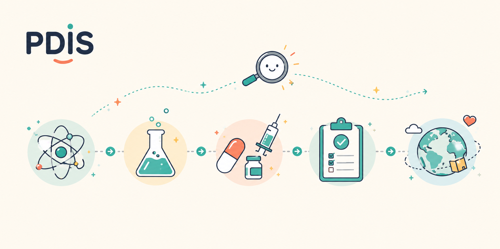

# PDIS — Product Development Intelligence Suite

<p align="center">
  
  
  
  
  
  
</p>

PDIS turns product-development documents into traceable, citable analysis. It
parses DOCX/PDF/PPTX files, reviews them against a document-specific rubric,
traces commitments across documents, pressure-tests targets against live external evidence, and supports
grounded follow-up questions over the saved result and source document.

PDIS currently supports intervention and candidate Target Product Profiles
(`itpp`, `ctpp`) and Integrated Product Development Plans (`ipdp`) across
vaccines, drugs, diagnostics, and devices.

## Product surfaces

| Surface | Responsibility | Output |
|---|---|---|
| **Chunker** | Parse DOCX, PDF, or PPTX into ordered, citable blocks while retaining visuals. | `ContentBlock[]` |
| **Inspector** | Check document completeness, rubric adherence, rigor, and cross-section consistency. | `InspectionResult` |
| **Aligner** | Trace explicit targets, activities, milestones, requirements, dependencies, and risk responses across two documents. | `AlignmentResult` |
| **Scout** | Compare document targets with live evidence, quantitative alignment, and precedent. | `ScoutResult` |
| **Searcher** | Debug or use the registered retrieval sources directly with a free-text query. | `Finding[]` |
| **Ask** | Answer read-only questions from an Inspector, Aligner, or Scout result and its parsed source documents. | Streamed text |

Scout is intentionally named as an evidence reconnaissance tool: it surfaces
and structures evidence signals without claiming definitive verification.

## Quick start

The production-like local setup runs the web app, API, and private
ToolUniverse service as separate containers.

```bash
cp .env.example .env
cp .env.tooluniverse.example .env.tooluniverse
cp web/.env.local.example web/.env.local

# Fill the copied files once, then start the stack.
docker compose up --build
```

Open:

- Web: <http://localhost:3000>
- API health: <http://localhost:8000/api/health>
- API documentation: <http://localhost:8000/docs>

After the first build, `docker compose up` is sufficient. Docker Desktop can
start and stop the saved `pdis` stack without re-entering credentials.

For a faster native development loop, keep ToolUniverse in Docker and run the
API/web processes locally:

```bash
docker compose up -d tooluniverse

source .venv/bin/activate
pip install -r requirements.txt
python -m uvicorn api.main:app --reload --port 8000

cd web
npm install
npm run dev
```

## Architecture

```text
Browser
  │
  ▼
web/ (Next.js)
  │  multipart + streamed NDJSON/plain text
  ▼
api/ (FastAPI composition boundary)
  │
  ├── services/chunker
  ├── services/inspector ─▶ chunker public contract
  ├── services/aligner ───▶ chunker public contract
  ├── services/scout ─────▶ chunker + searcher public contracts
  ├── services/searcher ──▶ direct APIs + injected ToolUniverse connector
  └── services/assistant
          │
          ▼
shared/ (provider clients + controlled vocabularies)
```

Imports flow only `web → api → services → shared`. Services use another
service only through its package `__init__.py`; they never import another
service's stages or models. The API constructs the shared provider clients and
connector integrations. Services remain stateless—live retrieval and model
outputs can vary, but no hidden server session is required.

Detailed service contracts:

- [Chunker](services/chunker/README.md)
- [Inspector](services/inspector/README.md)
- [Aligner](services/aligner/README.md)
- [Searcher](services/searcher/README.md)
- [Scout](services/scout/README.md)
- [Ask](services/assistant/README.md)

## Document identity and provenance

Document tools use four primitives:

| Field | Meaning |
|---|---|
| `org` | Publishing organization, such as `bmgf` |
| `source_type` | `itpp`, `ctpp`, or `ipdp` |
| `intervention_class` | `vaccine`, `drug`, `diagnostic`, or `device` |
| `indication` | Disease or condition that scopes retrieval |

The first three select YAML configs; all four are stamped on outputs. The API
passes the original upload filename stem as `doc_id`, so temporary upload names
never leak into block IDs.

Chunker emits ordered `ContentBlock`s with stable IDs. Embedded DOCX images and
rendered PPTX slides are canonical `image` blocks carrying media type, base64
bytes, SHA-256, and source media type. Supported raster bytes are retained;
Pillow normalizes other raster formats; LibreOffice handles vector fallback and
PPTX slide rendering. Images remain tied to their exact block IDs in Mapper,
Inspector, Scout, and Ask.

## Canonical Scout field model

Scout evaluates one canonical `Attribute` shape regardless of document type:

| Field | Meaning |
|---|---|
| `name` | Stable field identifier |
| `description` | Neutral definition of what is evaluated |
| `document_target` | Exact document claim, constraint, or commitment |
| `block_ids` | Document blocks supporting that target |
| `document_spans` | Exact quote-to-block provenance from which the canonical target is derived |
| `definition_mode` | `fixed` for vocabulary TPP fields or `dynamic` for extracted IPDP claims |
| `target_resolved` | Whether document binding has completed, including an intentionally absent target |
| `target_resolution_reason` | Explicit outcome or fail-closed reason for the binding decision |
| `evidence_domain` | One closed domain used for deterministic source applicability |
| `entities` | Explicitly document-stated typed entities and optional stated identifiers |
| `quantitative_targets` | Independently calibratable scalar claims with one canonical owner, exact literal numeric grounding, typed meaning, and explicit comparison dimensions |
| `quantitative_statement_dispositions` | Exact cited numeric-looking statements intentionally retained as contextual, non-scalar, range/set, or uncertain instead of being coerced into targets |
| `quantitative_target_status` | `present`, `not_applicable`, or `uncertain`, so an empty target list is never ambiguous |

The run also carries one canonical `QuantitativeLedger`. Numeric interpretation
receives only the exact spans already bound to canonical fields; it does not
rescan the raw document or choose field ownership again. Proposed targets and
uncertain exclusions are reviewed before retrieval. The reviewed ledger is the
sole source from which per-field quantitative targets and dispositions are
projected.

TPP fields come from `shared/attributes.yaml`. They are resolved in bounded
output batches that each see one complete block-aligned document chunk and the
complete field catalog. All ordered chunks are then merged into one
document-level claim ledger using exact
quoted spans. A structurally missing or invalid decision is retried once; any
remaining uncertainty stops before numeric interpretation or retrieval. IPDP
fields are dynamically extracted checkable claims from block-aligned document context.
Both converge to the same `Attribute` ledger before query generation;
downstream reasoning cannot rewrite the canonical target.

Evidence domains are `general`, `biological`, `clinical`, `safety`,
`regulatory`, `product`, `manufacturing`, `delivery`, and
`commercial_access`. Entity types are also closed and validated: disease,
pathogen, protein, gene, antigen, vaccine, drug, compound, biomarker, device,
and `other`.

## Scout pipeline

```text
parse document blocks and visuals
→ validate configured indication against cited document context
→ resolve one canonical document-claim ledger in bounded outputs over ordered document chunks and the complete field catalog
→ stop before retrieval if claim resolution remains incomplete after one targeted retry
→ map each complete canonical field span into target proposals or explicit non-target dispositions, with ownership fixed upstream
→ review and freeze proposed targets and uncertain exclusions in a portable client-held draft
→ deterministically project approved targets to their canonical fields
→ generate threshold-neutral source-neutral query intents with block and target lineage
→ determine source applicability from closed metadata
→ compile source-native requests in each adapter
→ execute fair concurrent source queues
→ normalize and deduplicate Findings without losing retrieval paths
→ extract atomic Insights
→ classify target relationship
→ assess grounding
→ normalize target/source meaning and source ownership into one typed semantic contract
→ map each bounded source-owned passage to complete measurements or an explicit no-result/uncertain disposition
→ validate the shared typed wire contract, immutable spans, literal syntax, mechanically readable magnitudes, and provenance
→ retain prose-derived measurements in a client-held review draft; auto-admit only typed structured facts
→ resolve every approve/reject decision before finalization
→ calculate one traceable descriptive calibration per target over a deduplicated cohort
→ assess precedent coverage and outcome
→ explicitly finalize and emit one immutable portable result
```

General, geographic, counterfactual, and precedent query tracks are additive.
Each generated intent retains the exact document block IDs that shaped it.
The general track provides retrieval coverage for every verified quantitative
target; target IDs remain retrieval lineage and never imply that a returned
source semantically supports the target. Calibration consumes this same target
bundle rather than asking the model to extract a second, potentially different
set after retrieval.
Only resolved fields with document-present targets proceed to retrieval; absent
fields remain visible in the result without generating evidence queries.
After field resolution, Scout presents each complete canonical field span to
numeric interpretation with its owner already fixed. The span retains table
labels and qualifiers that sentence-level splitting previously lost. The model
returns its exact literal parts and normalized expression; code resolves
provenance from the existing span and verifies that numeric magnitudes were not
changed. The model cannot reassign a proposal to another field.
Independently comparable scalars become atomic targets;
conditions, numeric categories, ranges/sets, nonnumeric text, and unresolved
wording receive explicit ledger classifications. Exact target syntax remains
quote-verified against its source unit. Missing, duplicated, or invalid reviews
are retried once by statement ID, then fail closed as ledger uncertainty. Field
targets are deterministic projections
of this one ledger; there is no per-field extraction competition, retry mapper,
or downstream ownership-repair pass. Numeric mapping cannot create a target for
an unresolved qualitative field or reassign a statement outside that field's
canonical cited blocks.
Targets use an eight-slot semantic profile (measure, endpoint, intervention,
population, regimen, time horizon, statistic, and conditions) plus explicit
comparison dimensions. Essential but unresolved dimensions therefore fail
closed rather than being treated as unconstrained. Conditions are restricted to
measurement settings that affect numeric comparability. Each
source measurement has one semantic assessment that returns only the slots
constrained by that target, co-locating the normalized source value and a closed
yes/no/unknown compatibility decision, plus source ownership. Code fills the
unconstrained slots neutrally to preserve the full public contract.
Only target-constrained slots can make a candidate semantically eligible;
ambiguous target slots fail closed. Eligibility is not admission: prose-derived
numbers remain review candidates, while only adapter-owned typed numeric facts
may be auto-admitted. Explicit approve/reject decisions are completed in the
client-held draft; the final portable result stores those decisions and cannot
be emitted while any remain unresolved. Deterministic statistics consume only
admitted records.
Every native request records its compiled intent IDs/texts, tracks, options,
connector operation, status, result count, and URLs.

## Retrieval sources

Searcher owns source grammar, credentials, execution policy, and response
normalization. Scout only supplies neutral intent and chooses enabled adapter
keys through config.

| Source key | Execution | Intended coverage |
|---|---|---|
| `web` | OpenAI web search | Broad current evidence |
| `pubmed` | Direct NCBI API | Biomedical literature and available PMC text |
| `clinicaltrials` | Direct ClinicalTrials.gov API v2 | Clinical and safety trials |
| `ctis` | ToolUniverse | EU clinical and safety trials |
| `isrctn` | ToolUniverse | International clinical and safety trials |
| `semantic_scholar` | ToolUniverse | Cross-disciplinary literature discovery |
| `open_targets` | ToolUniverse | Target–disease association evidence for drug biological fields |
| `chembl` | ToolUniverse | Reference compound/target records and explicit development phase metadata |
| `uniprot` | ToolUniverse | Reference protein, gene, antigen, and biomarker records |
| `fda` | ToolUniverse | Drug labels and device 510(k) regulatory records |
| `fda_safety` | ToolUniverse | Product-specific FDA label warnings, FAERS reports, MAUDE events, and device recalls |

Broad web/literature lanes can serve every field. Specialized lanes declare
supported evidence domains and, where needed, required entity types. The
generic controller makes a deterministic metadata match—there is no second LLM
router. A non-applicable enabled lane produces a traced `skipped` outcome and
does not call its connector. Empty successful searches and source failures stay
distinct from skips.

Molecular lanes are not universal. Drug configs can use Open Targets, ChEMBL,
and UniProt; vaccine and diagnostic configs retain only entity-gated UniProt;
device configs use none of them. ChEMBL and UniProt catalog records are marked
as reference-only and never enter Scout's evidence reasoning. Open Targets
emits actual target–disease evidence rather than entity-search cards.

Native request counts intentionally differ by source. Web can execute each
intent. PubMed and Semantic Scholar compile each track from the canonical
indication, intervention, field topic, and definition, while retaining every
generated wording as request lineage; multilingual web phrasing is never
concatenated into an over-constrained literature query. Structured registries
retrieve a bounded candidate set and rank it deterministically against the full
neutral intent bundle. Rate limits change scheduling, never which upstream
intents are silently retained or discarded.

### ToolUniverse boundary

PDIS calls an authenticated private ToolUniverse HTTP service instead of
installing its full scientific SDK in the API image. ToolUniverse standardizes
execution; each PDIS adapter still owns the database-specific request and
normalized response contract. There is no generic “ToolUniverse” evidence lane
and no autonomous tool selection.

The package is pinned in `deploy/tooluniverse/Dockerfile`. Registered operations
are allowlisted from adapter metadata. `TOOLUNIVERSE_API_TOKEN` protects the
PDIS-to-ToolUniverse connection; database credentials remain in the
ToolUniverse environment.

Open Targets, ChEMBL, UniProt, CTIS, ISRCTN, and the configured FDA operations
do not require additional provider credentials. Semantic Scholar uses the key
owned by the ToolUniverse service.

## Scout result semantics

The four primary axes are independent:

| Axis | Values | Ownership |
|---|---|---|
| Target relationship | `contradicts`, `extends`, `confirms`, `unrelated` | LLM over one insight and cited document blocks |
| Grounding | `well_grounded`, `partial`, `thin`, `unsupported`, `unknown` | LLM selection over closed labels; cited insight IDs resolved deterministically |
| Quantitative calibration | Reviewable numeric-candidate ledger plus one descriptive distribution per target over admitted evidence | AI maps complete source-owned passages into exact-quoted candidates; prose requires explicit review, typed structured facts may be auto-admitted, and deterministic code verifies provenance, deduplicates admitted records, and calculates every statistic |
| Precedent | Coverage: `direct`, `adjacent`, `none`, `unknown`; outcome tracked separately | LLM selection over distinct closed labels with deterministic lineage validation |

LLMs may classify or select only within closed vocabularies. Code validates
document IDs, insight IDs, URLs, units, provenance, deduplication, and
rollups. Holistic “basis” tags are intentionally not part of the result model.

Two deterministic projections sit beside—not inside—the four axes:

- **Development landscape** groups explicit program, sponsor, phase, and status
  fields normalized from trial, compound, and regulatory records.
- **Safety signals** groups official warnings, recalls, and surveillance reports.
  FAERS and MAUDE observations are visibly qualified as non-causal and are
  never converted into incidence or risk scores. Raw FAERS counts and individual
  MAUDE reports are reference-only and do not enter Scout's evidence judgments.

### Evidence map

The Scout evidence map defaults to a focused projection; **All evidence** maps
every analyzed insight and cited source for the selected field. It is not the
complete retrieval trace:

```text
evaluated field → canonical document target → evidence insight → cited source
```

Relationship colors attach to the document target. Target text and blocks come
from the canonical field, never a downstream assessment copy. Focused mode
shows a deterministic, bounded sample for readability; selecting an insight
exposes all of its cited sources. The Fields view retains the complete analyzed
evidence, while `search_plan` in the downloaded result retains requests, skips,
failures, and full retrieval lineage.

## Inspector semantics

Inspector makes three independent judgments per rubric unit:

- **Completeness:** required content is present and substantive.
- **Adherence:** structure and rubric rules are followed.
- **Rigor:** content is specific, measurable, meaningful, and technically sound.

Variable → section → document grades are deterministic rollups. The only
whole-document model pass reports cross-section conflicts. Grades remain
`A`, `B`, `C`, `D`, `F`, or `N/A` for all three dimensions.
The rubric itself is the variable ledger, so an omitted model item cannot
silently improve a rollup. Cross-section conflicts cite exact blocks from every
named section and report whether the consistency pass completed.

Inspector evaluates document quality against an authored rubric. It may check
whether risks and mitigations are documented, but it does not assign program
risk levels, assess real-world feasibility, recommend funding decisions, or
produce an investment roadmap. Those are separate decision-support concerns.

## Aligner semantics

Aligner compares a reference artifact with a downstream or later artifact. It
extracts explicit units into one closed vocabulary—target, activity, milestone,
requirement, dependency, or risk response—then links them as `aligned`,
`modified`, `conflict`, `missing`, or `introduced`. Every unit and link retains
the exact `ContentBlock` IDs from both documents.

The model performs bounded extraction and matching. Code validates all IDs and
enums, fills omitted reference units as `missing`, derives unused comparison
units as `introduced`, and calculates counts deterministically. Aligner does not
grade either document, retrieve external evidence, or assign investment risk.
Semantic unit IDs remain stable as duplicate occurrences add provenance, and a
final integrity contract verifies the complete unit/link/count graph.

## Ask semantics

Ask is a stateless, read-only assistant. Each turn sends the result, parsed
source-document blocks, and conversation history. Ask can navigate the result,
search/read exact document blocks (including retained images), and fetch full
text only for URLs already cited in the result. It never runs a fresh evidence
search and never mutates analysis.

The API exposes both JSON `/api/assistant/ask` and plain-text streaming
`/api/assistant/ask/stream`; the web UI consumes the streaming endpoint through
the AI SDK client.

## API and progress

Document tool routes stream NDJSON events: `stage`, `complete`, or `error`.
Parallel fan-out stages include `completed` and `total`; single stages use an
indeterminate spinner. Browser uploads go directly to the FastAPI origin rather
than through a Next.js rewrite proxy. Ask uses its separate plain-text stream so
tool execution remains private while final tokens render incrementally.

## Portable result files

Inspector, Aligner, and Scout downloads use the versioned `pdis.result` envelope,
currently version **31**:

```text
schema + version + state: final + result_type
├── analysis
└── source_documents[]
    └── ordered ContentBlocks (including embedded image bytes)
```

For Scout, the initial run produces a client-held document-target review draft
before retrieval. An independent Anthropic review call prefills each existing target
as confirmed, excluded, or flagged and supplies a short reason; it cannot change
the target data or provenance. The board remains fully editable, and only flagged
items require a manual decision. Approved targets are frozen into the continuation request;
rejected and acknowledged-uncertain statements remain in the audit ledger but
cannot shape queries or statistics. Evidence mapping may then produce a second
review checkpoint. Drafts cannot be downloaded or sent to Ask. Each evidence decision is scoped to
one target and one evidence unit (a source record, or an explicitly
distinguished non-overlapping arm/cohort within it). When that unit contains alternative
estimates, the reviewer selects one or chooses that none apply; distinct arms
remain separately admissible. After every unit is resolved, PDIS shows a
review summary where the last decision can still be undone. Explicit
finalization then emits one final artifact; importing it never recalculates or
reopens those decisions.

The original PDF/DOCX/PPTX binary is not embedded. Parsed blocks and portable
image assets are embedded, which keeps Ask portable and stateless but can make
result files larger. A completed analysis is immutable: export and import
preserve the same canonical result and never rerun a reasoning stage. Backward
compatibility lives only in the import normalizer. Old results remain viewable,
but missing images, canonical-field metadata, query lineage, or retrieval
provenance cannot be reconstructed; rerun the analysis for a fully current
artifact.

## Configuration and extension

Human-owned domain content lives in YAML:

| Surface | Path | Responsibility |
|---|---|---|
| Chunker | `services/chunker/configs/{org}_{source_type}_{intervention}.yaml` | Section taxonomy and mapping guidance |
| Inspector | `services/inspector/configs/…` | Rubric, weights, dimension guidance |
| Aligner | `services/aligner/configs/alignment.yaml` | Closed unit/relation semantics and bounded execution settings |
| Scout | `services/scout/configs/…` | Enabled sources, query budgets, domain framing, unit provider |
| Indications | `shared/indications.yaml` | Indication choices by intervention |
| TPP fields | `shared/attributes.yaml` | Fixed definitions and authored evidence domains |

Adding an ordinary `(org, source_type, intervention_class)` product
configuration is a YAML change, not an engine branch. `itpp`, `ctpp`, and
`ipdp` differences belong in config framing and unit providers.

Adding a retrieval source requires one adapter, one registry entry, injected
connector capability if needed, and config opt-in. Scout, Ask, API schemas, and
UI source labels must not gain provider-specific branches; they discover source
metadata and consume normalized contracts.

## Environment variables

| File/service | Variable | Required | Purpose |
|---|---|---:|---|
| `.env` / API | `OPENAI_API_KEY` | Yes | Section mapping, inspection, alignment, Scout reasoning, Ask, and web search |
| `.env` / API | `OPENAI_MODEL_FAST` | No | Query generation, evidence summaries, terminal labels, and web search; defaults to `gpt-5.4-mini`. |
| `.env` / API | `OPENAI_MODEL_REASONING` | No | Canonical document interpretation and quantitative semantic mapping; defaults to `gpt-5.4`. |
| `.env` / API | `ANTHROPIC_API_KEY` | For AI-prefilled target review | Independent Scout document-target verification; without it all proposals remain manual flags. |
| `.env` / API | `ANTHROPIC_REVIEW_MODEL` | No | Server-owned verifier model; defaults to `claude-opus-5`. |
| `.env` / API | `NCBI_API_KEY` | No | Higher NCBI request limits |
| `.env` / API | `TOOLUNIVERSE_BASE_URL` | For local ToolUniverse | Private connector address |
| `.env` / API | `TOOLUNIVERSE_API_TOKEN` | With ToolUniverse | Shared bearer token |
| `.env` / API | `TOOLUNIVERSE_TIMEOUT_SECONDS` | No | Connector timeout |
| `.env` / API | `SEARCH_GLOBAL_WORKER_LIMIT` | No | Shared retrieval worker cap |
| `.env.tooluniverse` | `SEMANTIC_SCHOLAR_API_KEY` | For Semantic Scholar | Provider credential owned by ToolUniverse |
| `web/.env.local` | `NEXT_PUBLIC_PDIS_API_URL` | Local web | Browser-visible API origin; never place secrets here |

Secrets are server-side and the populated files are Git-ignored.

## Render deployment

`render.yaml` defines three services:

- `pdis-web`: public Next.js service.
- `pdis-api`: public Docker service.
- `pdis-tooluniverse`: private Docker service on Render's internal network.

Create a Render Blueprint from this repository. Render derives the API/web
addresses, private ToolUniverse host/port, and a shared generated bearer token.
Enter `OPENAI_API_KEY`, `ANTHROPIC_API_KEY`, optional `NCBI_API_KEY`, and
`SEMANTIC_SCHOLAR_API_KEY` when prompted. Render persists them; they are never
committed or exposed to the browser.

## Validation

Run the same checks expected for cross-layer changes:

```bash
PYTHONPYCACHEPREFIX=/tmp/pdis-pycache \
  .venv/bin/python -m compileall -q shared services api tests
.venv/bin/python -m unittest discover -s tests -v
npm --prefix web run test:evidence-map
npm --prefix web run typecheck
npm --prefix web run build
git diff --check
```

## Repository layout

```text
pdis/
├── api/                     FastAPI schemas, routes, streaming, composition
├── deploy/tooluniverse/     Pinned private ToolUniverse image and health check
├── services/
│   ├── assistant/           Read-only grounded Ask agent
│   ├── chunker/             Document parsing, images, section mapping
│   ├── inspector/           Rubric inspection and deterministic rollups
│   ├── scout/               Document-bound evidence reasoning pipeline
│   └── searcher/            Source registry, planning, execution, Findings
├── shared/                  Provider clients and controlled vocabularies
├── tests/                   Python contract and lineage tests
├── web/                     Next.js UI, result import/export, evidence map
├── compose.yaml             Local three-service stack
└── render.yaml              Render Blueprint
```

Implementation invariants for coding agents live in [AGENTS.md](AGENTS.md).
