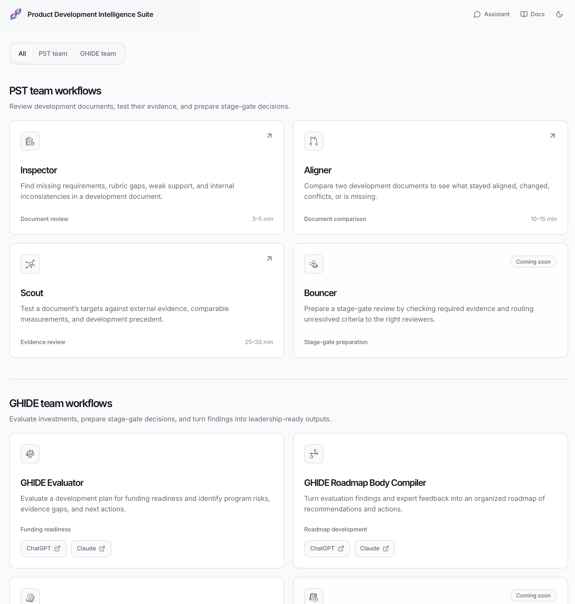
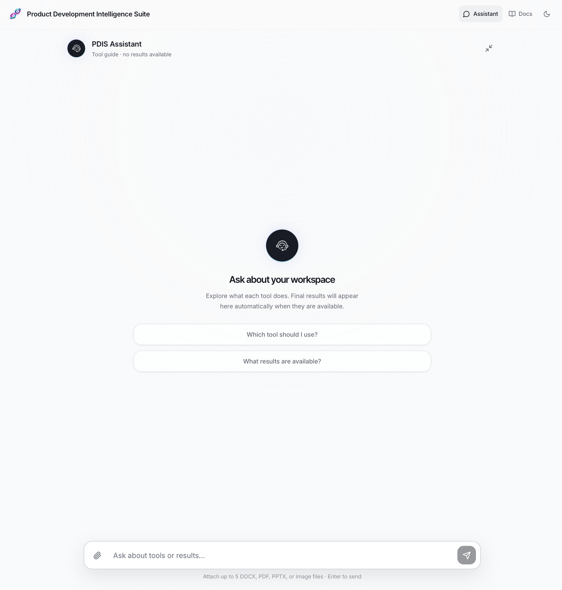

# Product Development Intelligence Suite (PDIS) for Health Interventions

Traceable document intelligence for product-development plans, evidence, and decisions.



PDIS turns DOCX and PPTX product-development documents into citable
analysis. It supports target product profiles and development plans for
vaccines, drugs, diagnostics, and devices while preserving the source blocks
behind every result.

## Table of Contents

- [Background](#background)
- [Install](#install)
- [Usage](#usage)
- [Tools](#tools)
- [Configuration](#configuration)
- [Development](#development)
- [Deployment](#deployment)
- [Contributing](#contributing)
- [License](#license)


## Background

Product-development work spans several distinct questions: whether a document
is complete, whether two documents agree, and whether stated targets are
supported by external evidence. PDIS keeps those responsibilities separate
instead of collapsing them into one score.

The system is stateless. Inspector, Aligner, Expert, and Scout produce portable,
versioned result files containing their parsed source blocks and retained
visuals. Imported final results are read-only and Assistant never performs a new
search.

Archivist is the one tool that reads a stored artifact rather than the document in
front of you, and it is stored for a reason: every row is a model's reading of a past
document, verified against a quote and then reviewed by a person before anyone relies
on it. Reading it involves no model call.

## Install

Docker Desktop is the recommended local environment.

```sh
cp .env.example .env
cp .env.tooluniverse.example .env.tooluniverse
cp web/.env.local.example web/.env.local
docker compose up --build
```

Set `OPENAI_API_KEY`, `ANTHROPIC_API_KEY`, and a shared
`TOOLUNIVERSE_API_TOKEN` in `.env`. Set `SEMANTIC_SCHOLAR_API_KEY` in
`.env.tooluniverse` when that source is enabled.

Open the application at [http://localhost:3000](http://localhost:3000). The API health endpoint and
OpenAPI reference are available at [http://localhost:8000/api/health](http://localhost:8000/api/health) and
[http://localhost:8000/docs](http://localhost:8000/docs).

### Dependencies

Native development requires Python 3.11 and Node.js 20. ToolUniverse can remain
in Docker while the API and web application run locally.

```sh
docker compose up -d tooluniverse

python3 -m venv .venv
source .venv/bin/activate
pip install -r requirements.txt
python -m uvicorn api.main:app --reload --port 8000
```

In another terminal:

```sh
cd web
npm install
npm run dev
```


## Usage

1. Open the workspace and choose a tool.
2. Select the requested product context.
3. Upload the source document or documents.
4. Resolve any Scout review checkpoint.
5. Inspect cited blocks and sources, then download the final result.

Assistant can navigate canonical PDIS process and architecture documentation,
the tool catalog, current client-held analyses and utility outputs, their
embedded source blocks, retained visuals, and already-cited URLs. Users may
also attach transient documents or images as conversation context. Assistant
cannot mutate results or retrieve new evidence. Conversation text, loaded
results, and attachments share one in-memory workspace lifecycle; final-result
export/import is the durable boundary.



## Tools


| Tool                                      | Responsibility                                                      |
| ----------------------------------------- | ------------------------------------------------------------------- |
| [Inspector](services/inspector/README.md) | Grade document completeness, adherence, rigor, and consistency.     |
| [Aligner](services/aligner/README.md)     | Check one document against another's requirements, one requirement at a time. |
| [Scout](services/scout/README.md)         | Test document targets against evidence, comparators, and precedent. |
| [Expert](services/expert/README.md)       | Decide which stage-gate questions the supplied documents answer.    |
| [Archivist](services/archivist/README.md) | Report what past profiles required for an attribute, and how many said nothing. |
| [Chunker](services/chunker/README.md)     | Produce ordered, citable text, table, and image blocks.             |
| [Searcher](services/searcher/README.md)   | Execute normalized retrieval across registered evidence sources.    |
| [Assistant](services/assistant/README.md) | Navigate available results and cited material across the workspace. |


External GHIDE decision workflows appear as labeled shortcuts in the workspace;
they are not executed by this repository.

## Configuration

Document workflows use four inputs: `org`, `source_type`,
`intervention_class`, and `indication`. The first three select YAML
configuration; `indication` scopes provenance and Scout retrieval.

Server credentials belong in `.env`; the browser environment contains only the
API origin. See [.env.example](.env.example) and
[web/.env.local.example](web/.env.local.example) for the supported variables.
Human-owned product rules live under `services/*/configs/` and `shared/`.
Public product documentation lives in `shared/product_knowledge.json`; the web
documentation page and Assistant read that same versioned source.

## Development

Run the contract and build checks before merging cross-layer changes.

```sh
PYTHONPYCACHEPREFIX=/tmp/pdis-pycache \
  .venv/bin/python -m compileall -q shared services api tests
.venv/bin/python -m unittest discover -s tests
npm --prefix web test
npm --prefix web run typecheck
npm --prefix web run build
git diff --check
```

Build the images when a Dockerfile or a published `shared/` artifact changes, since
the image build has its own copy rules.

```sh
docker compose build
```

Implementation invariants are documented in [AGENTS.md](AGENTS.md).

## Deployment

[render.yaml](render.yaml) creates one `PDIS` project with a `Production`
environment: a free public Next.js client, a Starter Docker API, and a Starter
private ToolUniverse connector. Create it with **New → Blueprint**, provide the
prompted provider credentials, and let Render derive all cross-service hosts and
the shared ToolUniverse token.

## Contributing

Questions and bug reports are welcome in
[GitHub Issues](https://github.com/jackyang25/pdis/issues). Pull requests should
preserve the contracts in [AGENTS.md](AGENTS.md) and pass the development checks
above.

## License

UNLICENSED.
